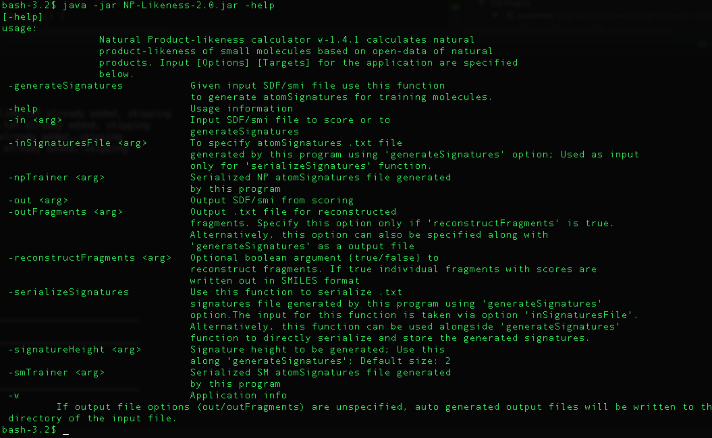

# NP-Likeness

#### About the Natural-Product-Likeness Scorer

The Natural-Product-Likeness Scorer [1] was developed by Kalai Vanii Jayaseelan (kalai@ebi.ac.uk), Andreas Truszkowski, Pablo Moreno, Peter Ertl and Christoph Steinbeck (christoph.steinbeck@uni-jena.de) to
provide an open-source, open-data re-implementation of Peter Ertl’s previous work [2].
Ertl originally developed this based on a close-data training set of natural products to screen large compound libraries for natural product likeness in drug designing studies. Our re-implemented NPlikeness scorer is using open source and open data to validate natural product likeness based on now publicly available sets of natural products described in [1]

The entire implementation is made as easy to use work-flows using CDK_Taverna2 an open source
plug-in for Taverna-2.2 which is an open source work-flow management system.

  - Taverna: http://www.taverna.org.uk/download/
  - CDK-Taverna plugin for Taverna: http://www.ts-concepts.de/cdk-taverna2/plugin/
  - The NPLikenessScorer.jar is a standalone Java ARchive offering the functionality similar to
the taverna workflows found here http://www.myexperiment.org/packs/183.html.

A conda package is available through [bioconda](https://bioconda.github.io). Simply install it with:

```sh
conda install -c bioconda np-likeness-scorer 
```

You can also use NPLS as [Docker](https://quay.io/repository/biocontainers/np-likeness-scorer?tab=tags)
or [Singularity](https://depot.galaxyproject.org/singularity/np-likeness-scorer%3A2.1--py27_0) container.
The Galaxy integration can be found at the [Galaxy ToolShed](https://toolshed.g2.bx.psu.edu/view/bgruening/natural_product_likeness) or as part of the [ChemicalToolBox](https://github.com/bgruening/docker-galaxy-chemicaltoolbox).


### Usage:
The standalone jar distributed with this release can be executed from the terminal using the
following option.

```$ java -jar /path/to/NPLikeness.jar ```

To get the usage information run the above command with -help option.

```$ java -jar /path/to/NPLikeness.jar -help ```

The following output after executing the above option. 

Few more input options have been added since the last release. The new additional options are to generate the training set using users personal training dataset. Please see Figure 2 for more information on training dataset creation.




Figure 1: Input options for NP-likeness calculator


Figure 2: Workflow of options to create user knowledge-base based
training set

#### Options
##### ``` - generateSignatures ```
This option is to generate atom centered fragments for molecules in both NP and SM datasets. In the current release the internal training dataset is now split into two - with fragments up to 3 spheres and 2 spheres. Previously the training set was based only on 2 spheres fragments, i,e. Signature height -2. The addition of 3-sphere fragments is just for experimental purpose only. There is no much difference in classifying compounds based on these different height trainers.

###### Example usage:
``` java -jar /path/to/NPlikeness.jar -in /path/to/sdf/or/smi/file -generateSignatures -signatureHeight 3 ```

The above command, writes out signatures of height 3 for the compounds in the dataset, to a auto generated file. 

To specify a file name to store the signatures, use the following option in addition.
``` java -jar /path/to/NPlikeness.jar -in /path/to/sdf/or/smi/file -generateSignatures -signatureHeight 3 -outFragments /path/to/text/file ```

The default signature height is 2. Use -signatureHeight option to specify sphere heights other than 2.

##### ``` - serializeSignatures ```
This function is to store the generated signatures in a serialized format. The serialized file is the map of fragments and its occurrence count in the compounds from both collection. This option can be used along with -generateSignatures option, directly to obtain the serialized file or can be executed as a different command.

###### Example usage:
``` java -jar /path/to/NPlikeness.jar -in /path/to/sdf/or/smi/file -generateSignatures -signatureHeight 3 ```

#####  ``` -outFragments /path/to/text/file -serializeSignatures ```

###### Example usage:
``` java -jar /path/to/NPlikeness.jar -inSignaturesFile /path/to/signatures/text/file -serializeSignatures ```

The above functions are for generating a training set based on your own training data. Once, you have this serialized file, you can use this .out files, as input for the scorer, to generate NP-likeness scores for any of your testing dataset.

###### Example usage to score for NP-likeness:
Currently, the scorer takes only SDF and .SMI files as input and output. To score a test file using the training set distributed with this package use the following option.
``` java -jar /path/to/NPlikeness.jar -in /path/to/sdf/or/smi/file ```

The above is the minimum input required. The output is written to a auto generated file and will be located in the directory same as the input file. The output for the program can be specified using,

``` java -jar /path/to/NPlikeness.jar -in /path/to/sdf/or/smi/file -out /path/to/sdf/or/smi/file ```

If you are interested in getting the individual fragments from the molecule with their corresponding NP-score use the following option.

``` java -jar /path/to/NPlikeness.jar -in /path/to/sdf/or/smi/file -reconstructFragments true ```

The reconstructed fragments will be written to a auto-generated file. If you want to specify a file name to the reconstructed fragments add the following option.

``` java -jar /path/to/NPlikeness.jar -in /path/to/sdf/or/smi/file -reconstructFragments true -outFragments /path/to/text/file ```

The scorer by default, fragments the input using signature height 2 and looks up in training set of signature height 2. If you want to look up in signature height 3, the input molecules should also be fragmented to signature height 3 and this can be specified in the input using,

``` java -jar /path/to/NPlikeness.jar -in /path/to/sdf/or/smi/file -signatureHeight 3 ```

Again, the training set distributed with this package has only 2 and 3 sphere training sets. You cannot use any other signature height when using the training set provided in this package. If you provide your own training set generated using different signature height (1, 2, 3 or more), you can specify that using -signatureHeight while calculating the scores. Remember, the signature height used for the training set and the one specified for testing should be the same, else you will have wrong scores. To use your own training set for the scoring use the following option,

``` java -jar /path/to/NPlikeness.jar -npTrainer /path/to/.out/NP/file -smTrainer /path/to/.out/SM/file -in /path/to/sdf/or/smi/file -signatureHeight <the one you used for generating the training set> ```

### References:
[1] KV Jayaseelan, C Steinbeck, P Moreno, A Truszkowski, P Ertl, Natural product-likeness score
revisited: an open-source, open-data implementation, BMC Bioinformatics 2012, 13:106
http://www.biomedcentral.com/1471-2105/13/106/abstract

[2] P Ertl, S Roggo, and A Schuffenhauer, Natural product-likeness score and its application for
prioritization of compound libraries., J. Chem. Inf. Model, 2008 vol. 48 (1) pp. 68-74
http://www.ncbi.nlm.nih.gov/pubmed/18034468


Copyright (c) 2013. EMBL, European Bioinformatics Institute
Freely distributed under Lesser General Public License
http://www.gnu.org/licenses/lgpl.html

